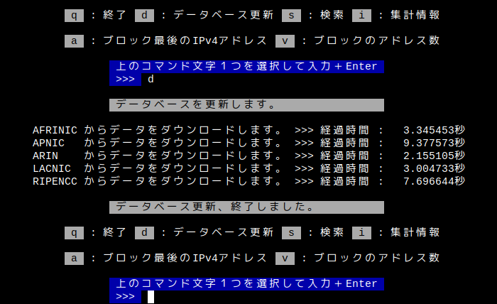

# ccipv4
[](https://github.com/suka-test/ccipv4/LICENSE)
[](https://go.dev/)

RIR statistics exchange format のデータを利用して、IPv4 アドレスからその所属国のカントリーコードを検索するためのGo言語用モジュールです。

RIR statistics exchange format については、後述の [「 RIR statistics exchange format 」](#rir-statistics-exchange-format) を参照してください。

***デモ用 CLI の画面 :***


## インストール

```
go get github.com/suka-test/ccipv4
```

## 動作環境

- Go 1.21 以降推奨（ net/netip を使っているので、導入されていない Go 1.17 以前では動きません。）

デモ用 CLI については

- Linux (AMD64, ARM64)
- Windows11 (AMD64)

で動作することを確認しています。

## モジュールの使い方

### 1. データベースの取得

まず、最初にデータベースを取得します。

```
import 	"github.com/suka-test/ccipv4" 

db := ccipv4.GetDB()                    
```

### 2. RIR statistics exchange format データの読込

取得した直後のデータベースの中身は空で、検索できません。RIR statistics exchange format データの読込が必要です。データの読込には２つ方法があります。一つはネットからダウンロードして直接読み込む方法です。もう一つは予めダウンロード等で用意したファイルから読み込む方法です。

1. ネットからダウンロードして直接読み込む方法

` db.LoadIPBDataByURL ` を使います。引数に、ダウンロードしたい RIR statistics exchange format データの URL を指定します。

```
url := "https://ftp.apnic.net/stats/apnic/delegated-apnic-extended-latest"

if err := db.LoadIPBDataByFile(url); err != nil {
	return err
}
```
５つある RIR のデータを全て読み込む場合は、URL を変えて、これを繰り返します。

> [!TIP]
> 各 RIR statistics exchange format データの最新版 URL は、以下の定数で用意されています。
>
> URL_DELEGATED_AFRINIC_EXTENDED_LATEST
>
> URL_DELEGATED_APNIC_EXTENDED_LATEST
>
> URL_DELEGATED_ARIN_EXTENDED_LATEST
>
> URL_DELEGATED_LACNIC_EXTENDED_LATEST
>
> URL_DELEGATED_RIPENCC_EXTENDED_LATEST

> [!CAUTION]
> サイズが大きいため、５つある RIR のデータ（２０２４年現在、合計２５メガバイトほど）を全て読み込むと、通信状況により相応の時間がかかります。光回線等、比較的高速の環境でも数十秒、もしくはそれ以上、かかる場合があります。

2. 用意したファイルから読み込む方法

` db.LoadIPBDataByFile ` を使います。引数に、読み込むファイルのパスを指定します。

```
if err := db.LoadIPBDataByFile("***.csv"); err != nil {
	return err
}
```

読み込むファイルが複数ある場合は、ファイルのパスを変えて、これを繰り返します。

> [!TIP]
> デモ用に５つの RIR のデータを編集して一つにまとめたファイルがあります。
>
> ` samples/demo_data.csv ` 
>
> テスト用にも使えます。

### 3. データの切替

読み込んだデータは、いったん一時保存用データベースに格納しており、実際に検索に使われる方のデータベースには反映されていません。` db.SwitchIPBData ` を使い、検索用データベースに新しいデータを反映させ、一時保存用は空にします。

```
db.SwitchIPBData()
```

これで検索ができるようになります。

> [!TIP]
> ` db.SetIPBData ` を使って、ネットから５つの RIR のデータ全てをダウンロードして読み込み、データの切替まで一括して行うこともできます。

```
if err := db.SetIPBData(); err != nil {
	return err
}
```

### 4. 検索

` db.SearchInfo ` を使います。引数に、IPv4 アドレスの文字列を指定します。

```
address = "1.0.0.0"

searchResult := db.SearchInfo(address)
```

検索結果を格納した ` SearchResult ` 構造体が戻り値となります。

### 5. 検索結果

検索結果を格納する ` SearchResult ` 構造体の内容は次のとおりです。

```
type SearchResult struct {
	IsFound    bool   // 検索したアドレスに対応するカントリーコードがみつかったか否か
	Message    string // 検索結果についてのメッセージ
	BlockStart string // 検索したアドレスが所属する割当ブロック先頭のアドレス
	BlockEnd   string // 検索したアドレスが所属する割当ブロック最後のアドレス
	Code       string // カントリーコード
	Name       string // カントリーコードに対応する国・地域の名称
	AltName    string // カントリーコードに対応する国・地域の名称（ Name 以外の名称・別名 ）
}
```

 ` IsFound ` が ` false ` の場合、` Message ` 以外のフィールドは空文字列になります。

 ` Message ` の種類は次のとおりです。

- ` "Invalid IP Address" ` : 不正な書式のアドレスで検索しようとした
- ` "Not IPv4 Address" ` : IPv4 ではないアドレスで検索しようとした
- ` "Loopback Address" ` : ループバックアドレスで検索しようとした
- ` "Multicast Address" ` : マルチキャストアドレスで検索しようとした
- ` "Private Address" ` : プライベートアドレスで検索しようとした
- ` "Not Found" ` : 検索したが、データの中に該当がなかった
- ` "Found" ` : みつかった

### 6. カントリーコードに対応する国・地域の名称

カントリーコードに対応する国・地域の名称は、RIR のデータには含まれていないので、カントリーコードをもとに別途調査することになります。予め調査しておいて、その内容をデータベースに反映させていれば、検索時の ` SearchResult ` 構造体のフィールドに含めることができます。

> [!CAUTION]
> 必須ではありません。データがなければ、検索結果を格納した ` SearchResult ` 構造体のフィールド ` Name ` と ` AltName ` が常に空になります。

1. 用意したファイルからデータを読み込む

` db.InitCCDataByFile ` を使います。引数に、読み込むファイルのパスを指定します。

```
ccDataFile := "countrycodes.csv"

if err := db.InitCCDataByFile(ccDataFile); err != nil {
	return err
}
```

2. ファイルのフォーマット

読み込むファイルのフォーマットは、区切り文字として縦線文字 | （ASCIIコード0x7c）が使用され、１行に次の３つの項目の値を持つCSVでなければなりません。

` カントリーコード|対応する国・地域の名称|別名 ` 

具体的には次のようになります。

` AD|Andorra|アンドラ `

> [!TIP]
> ` samples/country_code_list.csv ` は、カントリーコードと対応する国・地域の英語の名称と日本語の名称をデータに持つCSVファイルで、読み込んでデータベースに反映させることができます。

### 7. その他の機能

1. 国別ブロック合計を取得する

各国・地域に割り当てられた IPv4 アドレスのブロックの合計を取得します。` db.GetTotalBlocks ` を使います。

```
blocks := db.GetTotalBlocks()

// この例だと、日本に割り当てられている
// IPv4 アドレスのブロックの合計を表示
println(blocks["JP"])
```

2.  国別アドレス数合計を取得する

各国・地域に割り当てられた IPv4 アドレスの合計を取得します。` db.GetTotalValue ` を使います。

```
value := db.GetTotalValue()

// この例だと、日本に割り当てられている
// IPv4 アドレスの合計を表示
println(value["JP"])
```

3. start と value から、割り当てられる IPv4 アドレスのうち、最後のものを取得する

RIR statistics exchange forma の [レコード部フォーマット](#format-の概略)の項目、start（割り当てられる IPv4 アドレスのうち、最初のもの）と value（割り当てられる IPv4 アドレスの数）から、割り当てられる IPv4 アドレスのうち、最後のものを取得することができます。
` GetLastAddr ` を使います。データベースの取得は必要ありません。１番目の引数に、IPv4 アドレスの文字列を、２番目の引数に、 1 以上  4294967295 以下の整数を、それぞれ指定します。戻り値は netip.Addr と error になります。

```
start = "1.0.0.0"
value = 10000

// この例だと、last は "1.0.39.15" 
last, err := GetLastAddr(start, value)
```

4. ２つの IPv4 アドレスの範囲に含まれるアドレスの数を取得する

異なる２つの IPv4 アドレスを起点と終点とする IPv4 アドレスの範囲に含まれるアドレスの数（ RIR statistics exchange forma の [レコード部フォーマット](#format-の概略)の項目 value 相当）を取得することができます。` GetValue ` を使います。データベースの取得は必要ありません。１番目の引数、２番目の引数に、IPv4 アドレスの文字列を指定します。戻り値は int と error になります。正しい IPv4 アドレスの文字列であれば、１番目、２番目の引数を逆にしても、戻り値は同じです。

```
address1 = "1.1.1.1"
address2 = "2.2.2.2"

// この例だと、n は 16843010・引数の順番を変えて GetValue(address2, address1) でも同じ
n, err := GetValue(address1, address2)
```
## デモ用 CLI の使い方

このモジュールの動作のデモとモジュール利用の参考用に CLI を用意しています。

### 1. 起動

ターミナル等で ccipv4 配下のディレクトリ demo に移動し、次のコマンドを入力します。

```
go run demo.go
```

### 2. 最初の画面


起動時に上の画面が表示されます。赤地白文字の注意書きは起動直後にのみ表示されます。使いたい機能をコマンド文字＋ Enter で実行します。コマンド文字 q ＋ Enter で終了します。

### 3. データベース更新



コマンド文字 d ＋ Enter で、各 RIR statistics exchange format データの最新版をダウンロードして、データベースを更新します。

### 4. 検索


コマンド文字 s ＋ Enter で、さらに入力受付状態になります。ここでカントリーコードを検索する IPv4 アドレスの入力 ＋ Enter で、検索結果が表示されます。

### 5. 集計情報


コマンド文字 s ＋ Enter で、各国・地域に対する IPv4 アドレスの割当状況の集計が表示されます。

### 6. ブロック最後の IPv4 アドレス


コマンド文字 a ＋ Enter で、さらに入力受付状態になります。ここで割当ブロック先頭の IPv4 アドレスの入力 ＋ Enter で、再度入力受付状態になり、ブロックのアドレス数（value）を 1 〜 4294967295 の範囲でを入力 ＋ Enterで、割当ブロック先頭の IPv4 アドレスが表示されます。各入力受付状態で b ＋ Enter だと、処理を中断しコマンド選択へ戻ります。

### 7. ブロックのアドレス数


コマンド文字 v ＋ Enter で、さらに入力受付状態になります。ここで IPv4 アドレスの入力 ＋ Enter で、再度入力受付状態になり、もう一度 IPv4 アドレスの入力 ＋ Enter で、入力した２つの IPv4 アドレスの間にあるアドレスの数（ RIR statistics exchange forma の [レコード部フォーマット](#format-の概略)の項目 value 相当）が表示されます。各入力受付状態で b ＋ Enter だと、処理を中断しコマンド選択へ戻ります。

## RIR statistics exchange format
### RIR とは
> 「Regional Internet Registry」を略してRIRとも言います。 特定地域内のIPアドレスの割り当て業務を行うレジストリです。 現在、APNIC(Asia Pacific Network Information Centre)、 ARIN(American Registry for Internet Numbers)、 RIPE NCC(Reseaux IP Europeens Network Coordination Centre)、 LACNIC(The Latin American and Caribbean IP address Regional Registry) 、 AfriNIC(African Network Information Centre)の5つがあり、 APNICはアジア太平洋地域、ARINは北米地域、RIPE NCCは欧州地域、 LACNICは中南米地域、AfriNICはアフリカ地域を受け持っています。

[JPNIC｜地域インターネットレジストリ(Regional Internet Registry)とは](https://www.nic.ad.jp/ja/basics/terms/rir.html) より

### RIR statistics exchange format とは

> __RIR statistics exchange format__

（訳）__RIR統計交換フォーマット__

> __RIRs must comply with this standard in every respect__

（訳）__RIRは、あらゆる面でこの基準に準拠しなければならない__

> This specification defines the file production cycle, naming and content for the RIR statistics files.

（訳）この仕様は、RIR 統計ファイルが作成される間隔、ファイル名の原則、およびその内容を定義する。

> The RIR statistics files summarize the current state of allocations and assignments of Internet number resources. They are intended to provide a snapshot of the status of Internet number resources, without any transactional or historical details.

（訳）RIR 統計ファイルは、インターネット番号リソースの割り当てと割り当ての現在の状態を要約したものである。変遷や履歴の詳細を除いた、インターネット番号リソースの状態のスナップショットを提供することを目的としている。

[APNIC｜RIR statistics exchange format](https://www.apnic.net/about-apnic/corporate-documents/documents/resource-guidelines/rir-statistics-exchange-format/) より

### format の概略

ファイルのフォーマットは、区切り文字として縦線文字 | （ASCIIコード0x7c）が使用されたCSVです。内容は、コメント部とヘッダー部とレコード部に分かれています。各割り当てIPアドレスとカントリーコードの情報が記載されるレコード部フォーマットは次のとおりです。

> registry|cc|type|start|value|date|status[|extensions...]

- registry : 各 RIR を指す文字列。afrinic, apnic, arin, iana, lacnic, ripencc のいずれか。 
- cc : [ISO 3166](https://www.iso.org/iso-3166-country-codes.html) 2-letter code に基づく英大文字２文字のコード。割り当てられた国を指す。
- type : インターネット番号リソースの種類を示す asn, ipv4, ipv6 のいずれか。
- start : 割り当てられる IPv4 アドレスのうち、最初のもの。
- value : IPv4 アドレスの場合、割り当てられる IPv4 アドレスの数。CIDR 表記できない数になる場合があるので、注意。
- date : 各 RIR により、allocation または assignment の status になった日付を YYYYMMDD の形式で示す。
- status : 割り当て状態を指す文字列。
- extensions : 拡張機能用。未定義。

１行分のレコードの例が次のとおりになります。

` arin|US|ipv4|6.0.0.0|16777216|19940201|allocated|c096bf755fee3dfb7b9046461595ebd0 `

その他詳細は [APNIC｜RIR statistics exchange format](https://www.apnic.net/about-apnic/corporate-documents/documents/resource-guidelines/rir-statistics-exchange-format/) を参照してください。

## Licence

[MIT](https://github.com/suka-test/ccipv4/LICENSE)

## Author

[suka-test](https://github.com/suka-test/)
